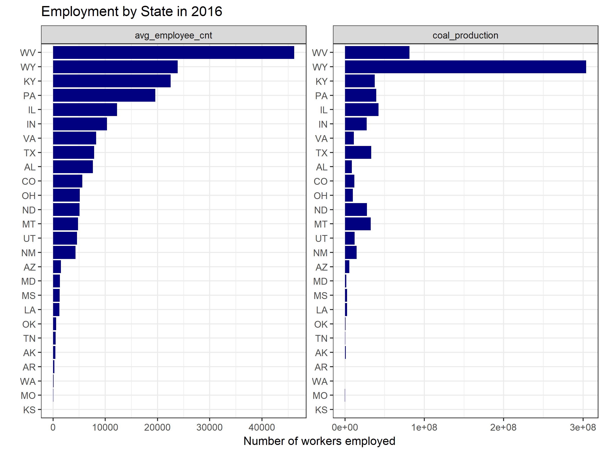
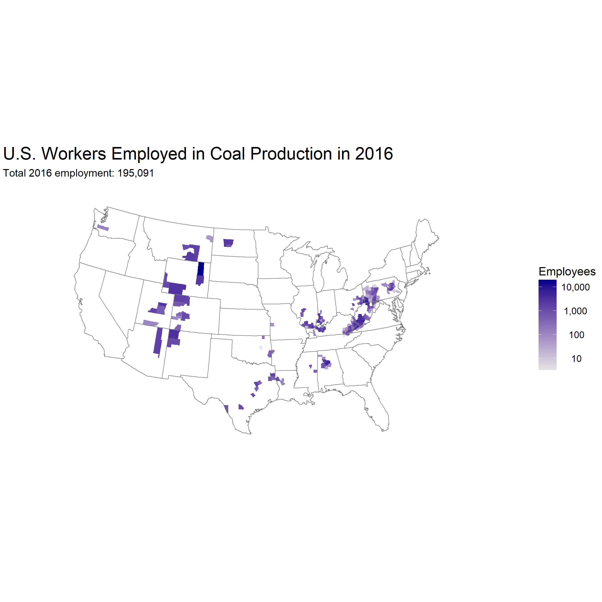
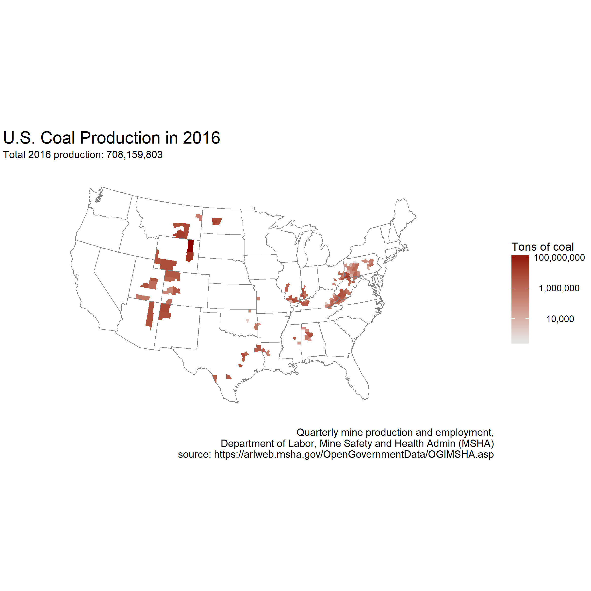

Project: Mapping and identifying trends in US Coal Production
-------------------------------------------------------------

#### *Bram Stone*

 

Coal production in the United States is a contentious issue and has received a resurgence of support in the current administration. As with any political issue, it is important to have a strong objective understanding of the situation in order to make informed decisions. This project demonstrates trends in coal over several decades, identifying patterns in production and employment. Raw data were obtained in `txt` files from the *Mine Safety and Health Administration (MSHA)*, which is under the US Department of Labor. **The key questions addressed by this exploration are:**

-   In which states, counties, and towns is coal most embedded? Where is production and employment highest?
    -   This question is important because it may show where support for coal is strongest, and where the support of alternative energy is weakest. Since this is a political topic, understanding the proportion of counties within a state affected by this issue may be relevent.
-   What are the overall trends in coal production, and does this pattern vary by region or locality?
    -   This question is important because it addresses which areas will be most affected by any loss in coal-based employment. Understanding regional variation will also help identify where coal production is robust in the face of national declines.

 

### 1. Data Import

First, the data were downloaded from two related sources both found at <https://arlweb.msha.gov/OpenGovernmentData/OGIMSHA.asp>:

1.  `Employment/Production Data Set (Quarterly)`: CSV of quarterly mine production and employment beginning in 2000 (171.8 Mb)
2.  `Mines Data Set`: CSV of information about the location and status of all mines in the US (34.4 Mb)

The following code creates a temporary file to store the compressed contents of each data set which are then imported using `read.table`. The temporary file is then deleted after the R session is over. If the data are already downloaded and uncompressed, a faster way to import is to use the `data.table` package. There are nearly 2 million rows in the mining productivity dataset and 86 thousand in the mine information dataset.

``` r
temp <- tempfile()

#employment/production data
download.file('https://arlweb.msha.gov/OpenGovernmentData/DataSets/ContractorProdQuarterly.zip', 
              temp, mode='wb')
coal <- read.table(unz(temp, 'MinesProdQuarterly.txt'), sep='|', header=T)

#mine information
download.file('https://arlweb.msha.gov/OpenGovernmentData/DataSets/Mines.zip', 
              temp, mode='wb')
mines <- read.table(unz(temp, 'Mines.txt'), sep='|', header=T)
dim(coal); dim(mines)

unlink(temp)
```

    ## [1] 1902038      13

    ## [1] 86880    59

 

### 2. Data Exploration

The next step is to clean and combine these data for downstream analyses and visualizations. First, column names are converted to lowercase to conform to best database practices, then non-coal mines are excluded from the data. Finally, coal productivity is merged with mine information using a left-join. Lastly, a function is applied across the dataset counting the number of NA values, which may be relevant for future steps.

``` r
names(coal) <- tolower(names(coal))
names(mines) <- tolower(names(mines))

coal <- coal[coal$coal_metal_ind=='C',]
mine_vars_to_keep <- c('mine_id', 
                       'current_mine_status', 
                       'fips_cnty_cd', 
                       'fips_cnty_nm', 
                       'bom_state_cd')

coal_mines <- merge(coal, mines[mine_vars_to_keep], by='mine_id', all.x=T)
dim(coal_mines); coal_mines[1:6,1:6]
```

    ## [1] 271217     17

    ##   mine_id     curr_mine_nm state subunit_cd
    ## 1 0100163 Arkadelphia 5761    AL         30
    ## 2 0100163 Arkadelphia 5761    AL         03
    ## 3 0100163 Arkadelphia 5761    AL         99
    ## 4 0100163 Arkadelphia 5761    AL         03
    ## 5 0100163 Arkadelphia 5761    AL         99
    ## 6 0100163 Arkadelphia 5761    AL         30
    ##                            subunit cal_yr
    ## 1 MILL OPERATION/PREPARATION PLANT   2005
    ## 2           STRIP, QUARY, OPEN PIT   2005
    ## 3      OFFICE WORKERS AT MINE SITE   2004
    ## 4           STRIP, QUARY, OPEN PIT   2005
    ## 5      OFFICE WORKERS AT MINE SITE   2005
    ## 6 MILL OPERATION/PREPARATION PLANT   2005

``` r
sapply(coal_mines, function(x) sum(is.na(x)))
```

    ##             mine_id        curr_mine_nm               state 
    ##                   0                   0                   0 
    ##          subunit_cd             subunit              cal_yr 
    ##                   0                   0                   0 
    ##             cal_qtr           fiscal_yr          fiscal_qtr 
    ##                   0                   0                   0 
    ##    avg_employee_cnt        hours_worked     coal_production 
    ##                   0                   0               22577 
    ##      coal_metal_ind current_mine_status        fips_cnty_cd 
    ##                   0                   0                   0 
    ##        fips_cnty_nm        bom_state_cd 
    ##                   0                   0

Right off the bat there are 22577 `NA` values in the `coal_production` variable, 8% of the dataset. It is worth exploring if there's any bias in these missing values. Here, the `aggregate` function is used to count the number observations that that are `NA` (*i.e.* have no production values reported). However this needs to be standardized, since states with more mines may presumably have more `NA` values (unless there's a bias). By dividing this value by the number of observations in the whole dataset, the *proportion* of missing production numbers can be seen. Earlier, the `current_mine_status` variable was noticed, and missing production values may be from mines that are no longer active. It is also worth looking to see if missing production values occur more often from certain states.

``` r
na.prop <- function(x) sum(is.na(x) / length(x))

#run separate summaries for each factor
(na_by_status <- aggregate(coal_production ~ current_mine_status, 
                           coal_mines, 
                           na.prop, 
                           na.action=NULL))
```

    ##    current_mine_status coal_production
    ## 1            Abandoned     0.101833428
    ## 2 Abandoned and Sealed     0.133319346
    ## 3               Active     0.065128933
    ## 4         Intermittent     0.067615658
    ## 5             New Mine     0.008086253
    ## 6         NonProducing     0.073162713
    ## 7    Temporarily Idled     0.041813196

``` r
na_by_state <- aggregate(coal_production ~ state, 
                         coal_mines, 
                         na.prop, 
                         na.action=NULL)

#are there more NA values in high or low production states?
prod_by_state <- aggregate(coal_production ~ state, coal_mines, function(x) sum(as.numeric(x)))
na_by_state <- merge(na_by_state, prod_by_state, by='state', all.x=T)

with(na_by_state, 
     plot(coal_production.y ~ coal_production.x, pch=21, cex=1.5, bg=hsv(0,.7,.8),
          xlab='Number of Missing Production Values', ylab='Total Coal Production',
          main='NA Values Against Total Coal Production')
)
```


    ## png 
    ##   2
   


It looks like `NA` values are more likely to occur from inactive and abandoned mines than those that are active, as expected, and there is some difference in the number of `NA` values per state. However, the amount of coal produced seems to have little bearing on the quality of the data. Removing these cases shouldn't bias our results against any highly productive or unproductive states.

#### Coal Production and Employment in 2016

It is worth looking at what coal production in the US currently looks like. Which are the top coal producing states? The code below looks at active and intermittently active mines during the year 2016. Production and employment are totaled by each mine in 2016, which are then aggregated to the state level for comparison Note: I try to utilze base code as much as possible given the size of the dataset (`data.table` and `dplyr` often outperform base functions and so are necessary in some cases) because I don't like too many dependencies in my code. `ggplot` is, however, used to construct visualizations, as it certainly produces very elegant code for exploratory data analyses. Both county and state data are manipulated into long format so that they can be faceted using the `reshape` function which isn't largely utilized due to several better, less obtuse, alternatives.

``` r
library(ggplot2)

#select mines active to some degree in 2016
active <- c('Active', 'Intermittent', 'New Mine')
coal_16 <- coal_mines[coal_mines$fiscal_yr==2016 & 
                        coal_mines$current_mine_status %in% active,]

#sum productivity and employees by mine and state (include state code as well)
by_mine <- aggregate(cbind(avg_employee_cnt, coal_production) ~ mine_id + state + bom_state_cd, 
                     data=coal_16, sum)

#which states have highest employment and productivity?
by_state <- aggregate(cbind(avg_employee_cnt, coal_production) ~ state, data=by_mine, sum)
by_state <- by_state[order(by_state$avg_employee_cnt, decreasing=T),]
by_state <- reshape(by_state, direction='long',
        idvar='state', varying=list(2:3), #keep state, condense columns 2 and 3
        v.names='value', #name condensed column 'value'
        times=names(by_state)[2:3], #numbers in 'value' column attributed to these names
        new.row.names=1:(nrow(by_state) * 2)) #override default rownames generated

#plot
state_compare <- ggplot(by_state, aes(reorder(state, sort(value, decreasing=T)), value)) +
  geom_bar(stat='identity',fill='navy') +
  facet_wrap(~ time, scales='free') + 
  coord_flip() +
  ylab('Number of workers employed') +
  xlab('') +
  labs(title='Employment by State in 2016') +
  theme_bw()

state_compare
```




Now that we can see who the top producing states are, let's look at a county-by-county comparison. In order to create a chloropleth map, where production and employment are quantified by color intensity, the data need to be related to a spatial database. Here, production and employment data is summarized by county, and merged with more county-based information from `chloroplethrMaps` that will allow the dataset to be mapped using `ggplot`. More specifically, data were joined on county *FIPS* (Federal Information Processing) codes. After joining, `NA` values were zeroed, redundante columns were removed, and county and state columns were renamed to `subregion` and `region`, respectively. This last part was to make data comply with `ggplot`'s expected column names.

``` r
library(choroplethrMaps)

#county info from choroplethrMaps
data(county.regions) 
county.regions <- within(county.regions, {
  fips_cnty_cd <- substr(county.fips.character,3,5)
  state <- state.abb
  fips_cnty_nm <- county.name
  county.name <- NULL
  state.abb <- NULL
  county.fips.character <- NULL
})

#summarize employment and productivity by county
by_mine <- merge(by_mine, mines, all.x=T)
by_county <- aggregate(cbind(avg_employee_cnt, coal_production) ~ fips_cnty_nm + fips_cnty_cd + state, 
                       data=by_mine, sum)

#make county names in dataset lowercase to match county.regions from chloroplethrMaps
by_county$fips_cnty_nm <- tolower(by_county$fips_cnty_nm)

#merge by FIPS code
by_county <- merge(by_county, county.regions)

#clean: replace NAs with 0 for plotting, change county info to 'subregion' and state info to 'region'
by_county <- within(by_county, {
  avg_employee_cnt[is.na(avg_employee_cnt)] <- 0
  coal_production[is.na(coal_production)] <- 0
  subregion <- fips_cnty_nm
  region <- state.name
  fips_cnty_nm <- NULL; state.name <- NULL
  state.fips.character <- NULL; state <- NULL
  fips_cnty_cd <- NULL
})
head(by_county)
```

    ##   avg_employee_cnt coal_production        region subregion
    ## 1              587          864643      maryland  allegany
    ## 2               26            9220  pennsylvania allegheny
    ## 3              287          285490  pennsylvania armstrong
    ## 4             1003         2706248         texas  atascosa
    ## 5             1016          909735 west virginia   barbour
    ## 6               70          189972      missouri     bates

``` r
#create map data
coal_map <- map_data('county')
coal_map <- merge(coal_map, by_county, all.x=T)
coal_map <- coal_map[order(coal_map$order),]
```

``` r
#If we wanted to change the scale of the log-tranformation, it would be done here and 'log5' could 
#be called in place of trans='log10' in the scale_fill_continuous function()
library(scales)
log5_trans <- function() {
  scales::trans_new('log5', function(x) log(x, base=5), function(x) 5^(x), breaks=log_breaks(10, 10))
}

#Map of employment
employ_map <- ggplot(coal_map, aes(long, lat, group=group, fill=avg_employee_cnt)) +
  geom_polygon() +
  coord_map('lambert', parameters=c(50,30)) +
  borders('state', size=.25) +
  scale_fill_continuous(labels=function(x) format(x, big.mark = ",", scientific = FALSE),
                        trans='log10', low=gray(.9), high='darkblue', na.value='white',
                        breaks=log_breaks() (c(10,10000))) +
  labs(fill='Employees',
    title='U.S. Workers Employed in Coal Production in 2016',
    subtitle=paste0('Total 2016 employment: ', format(sum(by_county$avg_employee_cnt), big.mark=','))) +
  theme_void() +
  theme(plot.title = element_text(size=rel(1.5)))

employ_map
```


    ## Warning: Transformation introduced infinite values in discrete y-axis



``` r
#for labeling
data_source <- paste0('Quarterly mine production and employment,', 
                      '\nDepartment of Labor, Mine Safety and Health Admin (MSHA)',
                      '\nsource: https://arlweb.msha.gov/OpenGovernmentData/OGIMSHA.asp')

#Map of coal production
product_map <- ggplot(coal_map, aes(long, lat, group=group, fill=coal_production)) +
  geom_polygon() +
  coord_map('lambert', parameters=c(50,30)) +
  borders('state', size=.25) +
  scale_fill_continuous(labels=function(x) format(x, big.mark = ",", scientific = FALSE),
                        trans='log10', low=gray(.9), high='darkred', na.value='white') +
  labs(fill='Tons of coal',
       title='U.S. Coal Production in 2016',
       subtitle=paste0('Total 2016 production: ', format(sum(by_county$coal_production), big.mark=',')),
       caption=data_source) +
  theme_void() +
  theme(plot.title = element_text(size=rel(1.5)))

product_map
```

    ## Warning: Transformation introduced infinite values in discrete y-axis


    ## Warning: Transformation introduced infinite values in discrete y-axis


